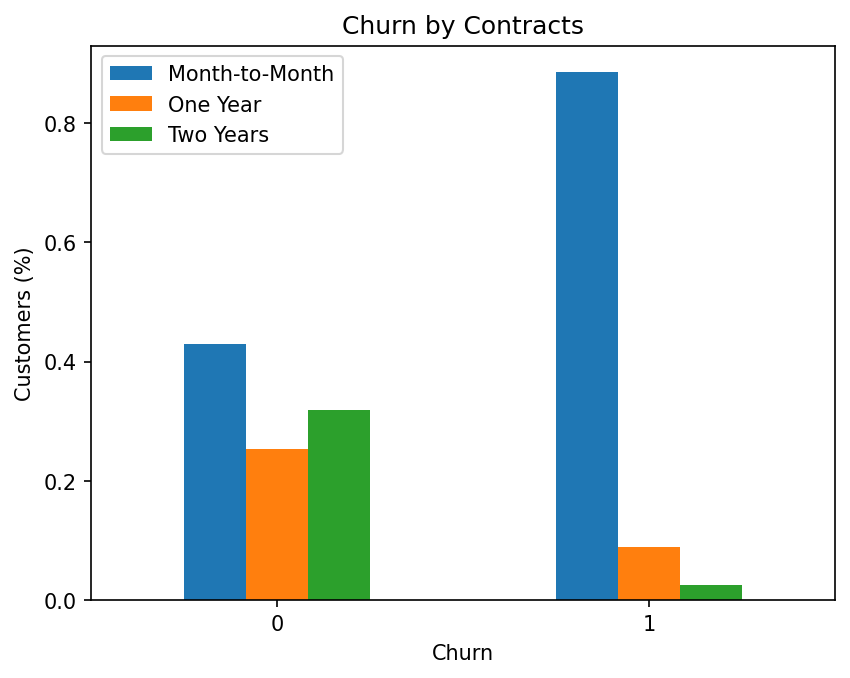
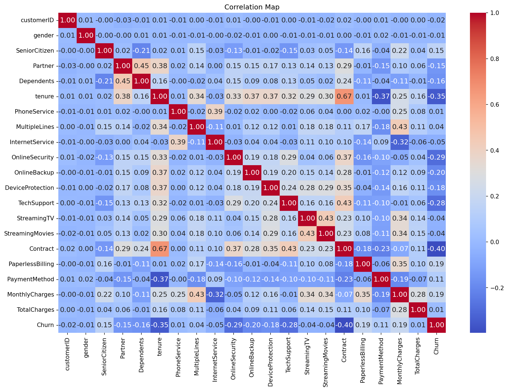

# 📊 Telco Customer Churn Prediction

Predict customer churn for a telecom company using machine learning models. The project includes EDA, feature engineering, and deployment via a live Streamlit app for real-time predictions.

<p align="center"> <a href="https://telco-churn-prediction-npw6k6cmkh7pf8zqbwfk3s.streamlit.app/" target="_blank">  </a> </p>

---
## 🌐 Live Streamlit App

👉 [Try it now](https://telco-churn-prediction-q7yq6vtgpcycymnuvkta8c.streamlit.app/)  

---

### 🧠 App Highlights

- Upload or input new customer data
- Predict churn probability using Logistic Regression or Random Forest
- Clean, responsive UI built with Streamlit
- View model prediction probabilities

---
## 🔍 Problem Statement

Customer churn significantly affects the profitability of subscription-based businesses. Understanding which customers are likely to churn helps reduce revenue loss and improve customer retention. This project builds a data-driven model to predict churn from customer attributes and service usage patterns.

---

## 🧰 Tools & Technologies

- Python (Jupyter Notebook)
- `pandas`, `NumPy`, `matplotlib`, `seaborn`, `joblib`
- scikit-learn: Logistic Regression, Random Forest, KNN
- Streamlit for web app deployment
- Git & GitHub for version control
---

## 📁 Dataset

- **Source**: [IBM Telco Customer Churn Dataset](https://www.kaggle.com/blastchar/telco-customer-churn)
- **Size**: ~7,000 entries, 21 features
- **Features**:
  - Demographics (gender, age, senior citizen)
  - Services (InternetService, Contract, PaymentMethod)
  - Tenure and monthly charges
  - Churn label (Yes/No)

---

## 🔄 Workflow Summary  
This project follows a typical machine learning pipeline:

- Data Cleaning & Preprocessing
- Exploratory Data Analysis (EDA)
- Feature Engineering
- Model Training (Logistic Regression, Random Forest, KNN)
- Model Evaluation using Accuracy, Precision, Recall, F1 Score, PR AUC score and ROC AUC score.
- Insights & Recommendations
- Developed and deployed a Streamlit app with Random Forest and Logistic Regression models for real-time customer churn prediction.

---

## Models used:

- Logistic Regression
- Random Forest
- K-Nearest Neighbors (KNN)

### Evaluation metrics:

- Accuracy, Precision, Recall, F1 Score, ROC AUC, PR AUC, ROC Curve, Precision-Recall Curve

---

## 📊 Model Performance

> Below is a summary of model performance based on recall and F1 score. For real-world churn prediction, recall is especially important to minimize missed churners.

| Model               | Recall | F1 Score | Notes                                 |
|--------------------|--------|----------|---------------------------------------|
| Logistic Regression| 78%    | Good     | High recall, best for catching churners |
| Random Forest      | 73%    | Best     | Balanced precision & recall             |
| KNN                | Low    | Poor     | Underperformed                         |

> **🔎 Note:** Threshold tuning (0.4 instead of 0.5) significantly improved recall:  
> - Logistic Regression: **89%**  
> - Random Forest: **86%**  
> However, the Streamlit app currently uses the default **0.5 threshold** for simplicity and user familiarity.

---

## 📊 Exploratory Data Analysis (EDA)

Key insights from the dataset:

- Customers on **month-to-month contracts** churn the most.
- **Electronic check** users have higher churn rates.
- **Short tenure** and **high monthly charges** correlate with churn

### 📈 Sample Visualizations

#### Churn by Contract Type


#### Correlation Heatmap


---

## 📁 Project Structure

```
├── data/
│   └── WA_Fn-UseC_-Telco-Customer-Churn.csv
├── images/
│   └── [plots and visualizations]
├── models/
│   ├── RandomForest_Churn_Model.joblib
│   └── LogisticRegression_Churn_Model.joblib
├── End-to-end-Churn-Prediction.ipynb
├── streamlit_app.py
├── README.md
└── requirements.txt```

---

## ✅ How to Run Locally

1. Clone this repository
2. Install dependencies:
   ```bash
   pip install -r requirements.txt
   ```
3. Open the notebook:
   ```bash
   jupyter notebook End-to-end-Churn-Prediction.ipynb
   ```
4. Or launch the app:
   ```bash
   streamlit run streamlit_app.py
   ```

---

## 📬 Contact

**Mahmood Arafat**  
Aspiring AI Engineer | Machine Learning Enthusiast

I'm passionate about building intelligent systems that solve real-world problems. With a background in Mechanical Engineering and hands-on experience in Python, data analysis, and model development, I'm actively transitioning into AI and machine learning—one project at a time.
[LinkedIn](https://www.linkedin.com/in/arafat-mahmood-3b0208213/) | [Email](Mahmoodarafat08@gmail.com)

---

